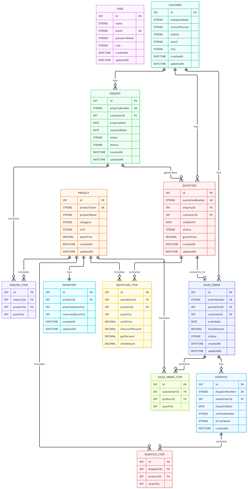

# ERP System

A full-stack Enterprise Resource Planning (ERP) system developed using the PERN stack.

The system manages the complete sales workflow:

Customer Enquiry
→ Quotation
→ Sales Order
→ Inventory Reservation
→ Dispatch

---

## 1. Project Overview

This ERP system provides role-based management of the sales and inventory workflow.

The application allows users to:

- Manage customer enquiries
- Create and manage quotations
- Convert accepted quotations into Sales Orders
- Reserve inventory during Sales Order confirmation
- Manage inventory quantities
- Create dispatches
- Enforce role-based access control
- Validate business rules on the backend
- Prevent duplicate Sales Orders
- Prevent insufficient inventory reservations
- Handle concurrent inventory reservations safely
- Track Sales Order and quotation statuses

The backend contains the main business logic and database operations, while the React frontend provides the user interface.

---

## 2. Technology Stack

### Frontend

- React
- Vite
- React Router
- Axios
- JavaScript
- CSS

### Backend

- Node.js
- Express.js
- REST APIs
- JWT Authentication
- Role-Based Access Control
- Zod Validation
- bcrypt

### Database

- PostgreSQL
- Prisma ORM
- Prisma Migrations
- Prisma Seed

### Testing

- Vitest
- Supertest

---

## 3. System Architecture

The application follows a layered full-stack architecture.

```text
                    React Frontend
                           |
                           | REST API
                           v
                    Express Backend
                           |
              +------------+------------+
              |                         |
       Authentication              Validation
       & Authorization                (Zod)
              |                         |
              +------------+------------+
                           |
                      Controllers
                           |
                        Services
                           |
                         Prisma
                           |
                       PostgreSQL
```

## 4. Project Structure

```text
erp-system/
│
├── backend/
│   ├── prisma/
│   │   ├── migrations/
│   │   ├── schema.prisma
│   │   └── seed.js
│   │
│   ├── src/
│   │   ├── controllers/
│   │   ├── middleware/
│   │   ├── routes/
│   │   ├── services/
│   │   ├── validators/
│   │   ├── app.js
│   │   └── server.js
│   │
│   ├── tests/
│   ├── .env.example
│   ├── package.json
│   ├── prisma.config.ts
│   └── vitest.config.js
│
└── frontend/
    ├── public/
    ├── src/
    ├── .env.example
    ├── package.json
    └── vite.config.js
```

## 5. Main Business Workflow

The ERP system follows this workflow:

```text
Customer Enquiry
       |
       v
   Quotation
       |
       | Accepted
       v
 Sales Order
       |
       | Confirm
       v
Inventory Reservation
       |
       | Dispatch
       v
   Dispatch
```

### Customer Enquiry

Sales users can create customer enquiries containing:

- Company name
- Contact person
- Mobile number
- Email
- City
- Enquiry date
- Required date
- Products
- Quantities
- Notes
- Status

### Quotation

Quotations contain:

- Products
- Quantity
- Unit price
- Discount
- GST
- Line amount
- Grand total
- Valid until date
- Status

Quotation totals are calculated and validated on the backend.

### Sales Order

An accepted quotation can be converted into a Sales Order.

The system prevents:

- Conversion of non-accepted quotations
- Duplicate Sales Orders for the same quotation

### Inventory Reservation

When a Sales Order is confirmed:

```
Available Quantity = Physical Quantity - Reserved Quantity
```

The system checks inventory availability before reservation.

Inventory reservation is handled transactionally to prevent concurrent reservations from exceeding available stock.

### Dispatch

When a confirmed Sales Order is dispatched:

- Physical quantity decreases
- Reserved quantity decreases
- Sales Order status becomes DISPATCHED

Invalid or duplicate dispatch operations are prevented.

## 6. Roles and Access Control

The system supports role-based access control.

### ADMIN

The Admin role has access to administrative and operational functionality according to the configured backend authorization rules.

### SALES_USER

The Sales User role is intended for sales workflow operations such as managing enquiries, quotations, and Sales Orders according to the configured backend permissions.

Authorization is enforced on the backend using JWT authentication and role-based middleware.

## 7. Seed Data

The project includes a Prisma seed script for initializing demo data.

Run the seed using:

```
cd backend
npx prisma db seed
```

### Demo Users

| Role | Email | Password |
|------|-------|----------|
| Admin | admin@erp.com | Admin@123 |
| Sales User | sales@erp.com | Sales@123 |

### Products

| Product | Initial Physical Quantity |
|---------|---------------------------|
| Industrial Ball Bearing | 100 |
| Three Phase Induction Motor | 50 |
| Centrifugal Water Pump | 40 |
| Industrial Gate Valve | 75 |
| Industrial PLC Controller | 20 |
| Industrial Power Cable | 1000 |

### Customers

- Apex Engineering Solutions
- Vertex Industrial Systems
- Prime Manufacturing Pvt Ltd

Inventory records are initialized with:

- Reserved Quantity = 0

The seed script uses upsert operations for users, products, and inventory, allowing the seed command to be executed repeatedly without creating duplicate records for those entities.

## 8. Environment Configuration

The project uses environment variables for database, authentication, and frontend API configuration.

### Backend

Create:

```
backend/.env
```

using the example file:

```
backend/.env.example
```

### Frontend

Create:

```
frontend/.env
```

using:

```
frontend/.env.example
```

## 9. Database Setup

The application uses PostgreSQL with Prisma ORM.

### Create the PostgreSQL Database

Create a PostgreSQL database named:

```
erp_system
```

Make sure PostgreSQL is running on:

```
localhost:5432
```

Update the DATABASE_URL in:

```
backend/.env
```

according to your PostgreSQL username, password, host, port, and database.

### Install Backend Dependencies

```
cd backend
npm install
```

### Apply Prisma Migrations

```
npx prisma migrate deploy
```

### Generate Prisma Client

```
npx prisma generate
```

### Seed the Database

```
npx prisma db seed
```

## 10. Running the Backend

Navigate to the backend:

```
cd backend
```

Install dependencies:

```
npm install
```

Start the backend in development mode:

```
npm run dev
```

The backend runs on:

```
http://localhost:5000
```

The production/start command is:

```
npm start
```

## 11. Running the Frontend

Open another terminal and navigate to the frontend:

```
cd frontend
```

Install dependencies:

```
npm install
```

Start the Vite development server:

```
npm run dev
```

The frontend will be available at the URL displayed by Vite, normally:

```
http://localhost:5173
```

## 12. Authentication

Authentication uses JWT tokens.

The login process is:

```text
User Login
    |
    v
Backend Authentication
    |
    v
JWT Token
    |
    v
Authenticated API Requests
```

Passwords are stored using bcrypt hashing.

Protected backend routes use authentication middleware, and restricted operations use role-based authorization.

## 13. API Overview

The backend exposes REST APIs for the major ERP modules.

### Authentication

```
POST /api/auth/login
```

### Customers

```
POST /api/customers
GET  /api/customers
GET  /api/customers/:id
```

### Enquiries

```
POST /api/enquiries
GET  /api/enquiries
GET  /api/enquiries/:id
```

### Quotations

```
POST  /api/quotations
GET   /api/quotations
GET   /api/quotations/:id
PATCH /api/quotations/:id/status
```

### Sales Orders

```
GET   /api/sales-orders
GET   /api/sales-orders/:id
POST  /api/sales-orders/from-quotation/:id
PATCH /api/sales-orders/:id/status
```

### Inventory

```
GET   /api/inventory
GET   /api/inventory/:productId
PATCH /api/inventory/:productId
```

### Dispatch

```
GET  /api/dispatches
GET  /api/dispatches/:id
POST /api/dispatches/sales-orders/:id
```

## 14. Backend Business Rules

The backend enforces the major business rules of the ERP workflow.

### Quotation

- Quantities must be valid
- Unit prices must be valid
- Discount and GST values are validated
- Line amounts are calculated on the backend
- Grand total is calculated on the backend
- Duplicate product lines are prevented
- Quotation status transitions are validated

### Sales Order

- Only accepted quotations can be converted
- A quotation can have only one Sales Order
- Duplicate Sales Order creation is prevented
- Sales Order status transitions are validated

### Inventory

Available quantity is calculated as:

```
Available = Physical Quantity - Reserved Quantity
```

- Reservations cannot exceed available inventory
- Inventory reservations are performed transactionally
- Concurrent reservation attempts are handled safely

### Dispatch

- Only valid confirmed Sales Orders can be dispatched
- Dispatch quantity cannot exceed reserved quantity
- Inventory quantities are updated during dispatch
- Duplicate or invalid dispatch operations are prevented

## 15. Testing

The project uses Vitest for automated testing.

Run the backend test suite:

```
cd backend
npm test -- --run
```

The test suite covers important business rules including:

- Quotation grand total calculation
- Invalid quotation conversion
- Duplicate Sales Order prevention
- Insufficient inventory reservation
- Concurrent inventory reservation handling
- Dispatch quantity validation
- Dispatch prevention for cancelled Sales Orders

### Final Test Result

The final backend automated test suite completed successfully.

```
Test Files: 3 passed
Tests:      6 passed
Command:    npm test -- --run
```

## 16. Frontend Build Verification

To verify that the React frontend builds successfully:

```
cd frontend
npm run build
```

For lint verification:

```
npm run lint
```

The production frontend build was successfully verified.

## 17. Final End-to-End Workflow

The complete workflow can be demonstrated as follows:

```text
1. Login
      |
      v
2. Create Customer Enquiry
      |
      v
3. Create Quotation
      |
      v
4. Send Quotation
      |
      v
5. Accept Quotation
      |
      v
6. Convert to Sales Order
      |
      v
7. Confirm Sales Order
      |
      v
8. Reserve Inventory
      |
      v
9. Dispatch Sales Order
      |
      v
10. Inventory Updated
```

The final system demonstrates the integration between:

- Sales workflow
- Authentication
- Authorization
- Database operations
- Inventory management
- Dispatch processing

## 18. Demo Credentials

### Admin

- Email: admin@erp.com
- Password: Admin@123

### Sales User

- Email: sales@erp.com
- Password: Sales@123

These credentials are intended for local/demo use with the seeded database.

## 19. ER Diagram

The following Entity Relationship Diagram represents the database structure and relationships of the ERP system.



## 20. API Documentation

The ERP system exposes REST APIs for authentication, customer management, enquiries, quotations, products, inventory, sales orders, and dispatch operations.

All protected APIs require a valid JWT access token.

### Authentication

| Method | Endpoint | Purpose | Authentication |
|--------|----------|---------|-----------------|
| POST | /api/auth/login | Authenticate a user and generate a JWT token | Public |

### Customers

| Method | Endpoint | Purpose | Role |
|--------|----------|---------|------|
| POST | /api/customers | Create a new customer | SALES_USER |
| GET | /api/customers | Get all customers | ADMIN, SALES_USER |
| GET | /api/customers/:id | Get a customer by ID | ADMIN, SALES_USER |

### Products

| Method | Endpoint | Purpose | Role |
|--------|----------|---------|------|
| GET | /api/products | Get all products | ADMIN, SALES_USER |
| GET | /api/products/:id | Get a product by ID | ADMIN, SALES_USER |

### Enquiries

| Method | Endpoint | Purpose | Role |
|--------|----------|---------|------|
| POST | /api/enquiries | Create a customer enquiry | ADMIN, SALES_USER |
| GET | /api/enquiries | Get all enquiries | ADMIN, SALES_USER |
| GET | /api/enquiries/:id | Get an enquiry by ID | ADMIN, SALES_USER |

### Quotations

| Method | Endpoint | Purpose | Role |
|--------|----------|---------|------|
| POST | /api/quotations | Create a quotation | ADMIN, SALES_USER |
| GET | /api/quotations | Get all quotations | ADMIN, SALES_USER |
| GET | /api/quotations/:id | Get a quotation by ID | ADMIN, SALES_USER |
| PATCH | /api/quotations/:id/status | Update quotation status | ADMIN, SALES_USER |

### Sales Orders

| Method | Endpoint | Purpose | Role |
|--------|----------|---------|------|
| GET | /api/sales-orders | Get all Sales Orders | ADMIN, SALES_USER |
| GET | /api/sales-orders/:id | Get a Sales Order by ID | ADMIN, SALES_USER |
| POST | /api/sales-orders/from-quotation/:id | Convert an accepted quotation into a Sales Order | ADMIN, SALES_USER |
| PATCH | /api/sales-orders/:id/status | Update Sales Order status | ADMIN |

### Inventory

| Method | Endpoint | Purpose | Role |
|--------|----------|---------|------|
| GET | /api/inventory | Get all inventory records | ADMIN, SALES_USER |
| GET | /api/inventory/:productId | Get inventory for a product | ADMIN, SALES_USER |
| PATCH | /api/inventory/:productId | Update product inventory | ADMIN |

### Dispatch

| Method | Endpoint | Purpose | Role |
|--------|----------|---------|------|
| GET | /api/dispatches | Get all dispatches | Authenticated users |
| GET | /api/dispatches/:id | Get a dispatch by ID | Authenticated users |
| POST | /api/dispatches/sales-orders/:id | Create a dispatch for a Sales Order | ADMIN |

### Authorization

Protected endpoints use JWT authentication.

The client sends the token using the HTTP Authorization header:

```
Authorization: Bearer <JWT_TOKEN>
```

## 21. Project Status

The ERP system implements the required sales and inventory workflow using a PERN-based full-stack architecture.

The main workflow is:

```text
Customer Enquiry
        ↓
Quotation
        ↓
Accepted Quotation
        ↓
Sales Order
        ↓
Inventory Reservation
        ↓
Dispatch
```

The system includes:

- Backend validation
- JWT authentication
- Role-based authorization
- Transactional inventory reservation
- Database persistence
- Automated tests
- React-based frontend
- PostgreSQL database
- Prisma ORM
- REST APIs
- Inventory management
- Dispatch management
